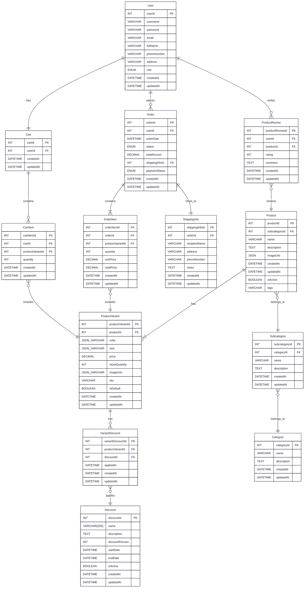

```mermaid
---
config:
  theme: redux
---
erDiagram
    User {
        INT userId PK
        VARCHAR username
        VARCHAR password
        VARCHAR email
        VARCHAR fullName
        VARCHAR phoneNumber
        VARCHAR address
        ENUM role
        DATETIME createdAt
        DATETIME updatedAt
    }
    Product {
        INT productId PK
        INT subcategoryId FK
        VARCHAR name
        TEXT description
        JSON imageUrls
        DATETIME createdAt
        DATETIME updatedAt
        BOOLEAN isActive
        VARCHAR tags
    }
    ProductVariant {
        INT productVariantId PK
        INT productId FK
        JSON_VARCHAR color
        JSON_VARCHAR size
        DECIMAL price
        INT stockQuantity
        JSON_VARCHAR imageUrls
        VARCHAR sku
        BOOLEAN isDefault
        DATETIME createdAt
        DATETIME updatedAt
    }
    Discount {
        INT discountId PK
        VARCHAR(255) name
        TEXT description
        INT discountPercent
        DATETIME startDate
        DATETIME endDate
        BOOLEAN isActive
        DATETIME createdAt
        DATETIME updatedAt
    }
    VariantDiscount {
        INT variantDiscountId PK
        INT productVariantId FK
        INT discountId FK
        DATETIME appliedAt
        DATETIME createdAt
        DATETIME updatedAt
    }
    Category {
        INT categoryId PK
        VARCHAR name
        TEXT description
        DATETIME createdAt
        DATETIME updatedAt
    }
    Subcategory {
        INT subcategoryId PK
        INT categoryId FK
        VARCHAR name
        TEXT description
        DATETIME createdAt
        DATETIME updatedAt
    }
    Cart {
        INT cartId PK
        INT userId FK
        DATETIME createdAt
        DATETIME updatedAt
    }
    CartItem {
        INT cartItemId PK
        INT cartId FK
        INT productVariantId FK
        INT quantity
        DATETIME createdAt
        DATETIME updatedAt
    }
    Order {
        INT orderId PK
        INT userId FK
        DATETIME orderDate
        ENUM status
        DECIMAL totalAmount
        INT shippingInfoId FK
        ENUM paymentStatus
        DATETIME createdAt
        DATETIME updatedAt
    }
    OrderItem {
        INT orderItemId PK
        INT orderId FK
        INT productVariantId FK
        INT quantity
        DECIMAL unitPrice
        DECIMAL totalPrice
        DATETIME createdAt
        DATETIME updatedAt
    }
    ShippingInfo {
        INT shippingInfoId PK
        INT orderId FK
        VARCHAR recipientName
        VARCHAR address
        VARCHAR phoneNumber
        TEXT notes
        DATETIME createdAt
        DATETIME updatedAt
    }
    ProductReview {
        INT productReviewId PK
        INT userId FK
        INT productId FK
        INT rating
        TEXT comment
        DATETIME createdAt
        DATETIME updatedAt
    }
    User ||--|| Cart : has
    User ||--o{ Order : places
    User ||--o{ ProductReview : writes
    Product ||--|{ ProductVariant : has
    ProductVariant ||--o{ VariantDiscount : has
    VariantDiscount }o--|| Discount : applies
    Product }o--|| Subcategory : belongs_to
    Subcategory }o--|| Category : belongs_to
    Cart ||--o{ CartItem : contains
    CartItem }o--|| ProductVariant : includes
    Order ||--|{ OrderItem : contains
    OrderItem }o--|| ProductVariant : includes
    Order ||--|| ShippingInfo : ships_to
    ProductReview }o--|| Product : reviews

```
